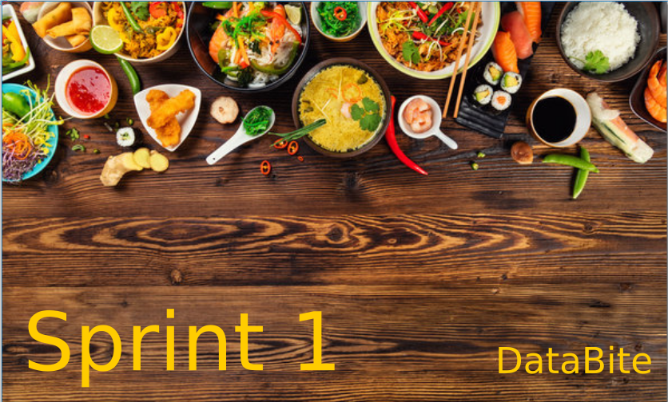

<h2 align='center'>💡 contexto</h2>

<h2 align='center'>🤝 propuesta de trabajo</h2>

<h2 align='center'> 📊 KPIs Clave</h2>
<ol>
<li>  Crecimiento de Frecuencia de Reseñas: Identificar regiones con alta interacción.</li>
<li> Índice de Satisfacción Promedio: Evaluar la percepción general del mercado.</li>
<li>Diversidad de Categorías Gastronómicas: Medir la riqueza culinaria con el Índice de Shannon.</li>
<li>Tasa de Crecimiento de Categorías Emergentes: Detectar nuevas oportunidades.</li>
<li>Calificación Promedio Delivery: Analizar cómo afecta el delivery a la experiencia del cliente.</li>
<li>Sentimiento Promedio Ponderado: Evaluar la percepción emocional de los clientes por categoría.</li>
</ol>

<h2 align='center'> 🛠️ tecnologias empleadas</h2>
    <ul>
        <li> Lenguajes y Librerías</li>
            <ul>
                <li> Python: pandas, numpy, sklearn, nltk, spaCy, matplotlib, seaborn.</li>
                <li> Geopandas y Folium: Análisis y visualización geoespacial.</li>
                <li> TensorFlow / PyTorch: Modelos avanzados de Machine Learning.</li>
            </ul>
        <li> Infraestructura</li>
            <ul>
                <li> Aws: Almacenamiento y procesamiento de datos en la nube.</li>
            </ul>
        <li> Visualización</li>
            <ul>
                <li> QuickSight: Dashboards interactivos para seguimiento de KPIs.</li>
            </ul>
    </ul>

<h2 align='center'>  📆  cronograma</h2>

